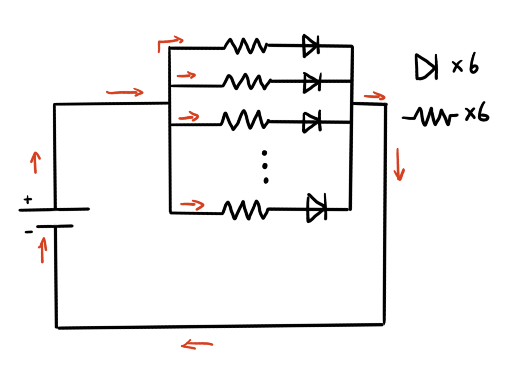
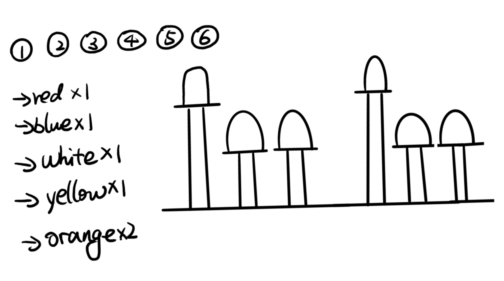

# HW10
In this assignment, we are tasked with using devices such as LED lights to visually represent the passage of one minute.  I opted for six LED lights, intending to have them illuminate sequentially every 10 seconds, symbolizing the progression of time.  Starting from 0 seconds, the leftmost LED lights up for 10 seconds, then extinguishes, followed by the illumination of the next LED in sequence.  This pattern continues until the sixth LED goes out, signifying the completion of one minute.

A schematic drawing of my circuit.

Due to some LEDs having similar colors, I ensured that adjacent LEDs had distinct colors to facilitate better differentiation when they light up.  In terms of circuit connection, I employed a parallel configuration, linking each LED's resistor to the power source and controlling them through different pins.

A Sketch
 

On the breadboard, I arranged the connections from D2 to D7, referring to the tutorial provided by the instructor.  Since the intervals between each LED and the duration of illumination were uniform, I maintained consistency when inputting the seconds.  The most challenging aspect of this assignment was orchestrating the sequential lighting and extinguishing of the LEDs, prompting me to consider using if and else statements.  By establishing specific conditions based on time and seconds, I successfully achieved the controlled sequencing of LED lights, adhering to the designated time intervals for illumination and extinction.
